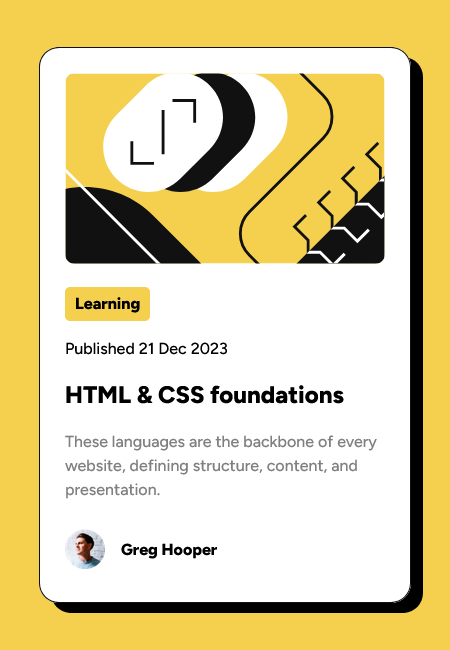
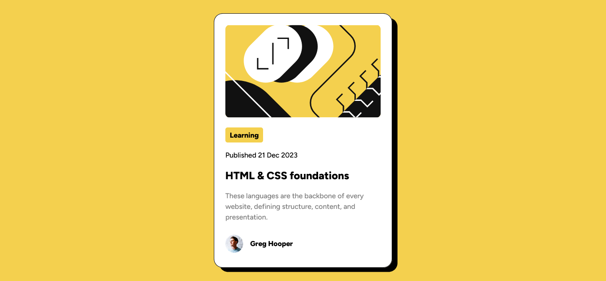

# Frontend Mentor - Blog preview card solution

This is a solution to the [Blog preview card challenge on Frontend Mentor](https://www.frontendmentor.io/challenges/blog-preview-card-ckPaj01IcS). Frontend Mentor challenges help you improve your coding skills by building realistic projects. 

## Table of contents

- [Overview](#overview)
  - [The challenge](#the-challenge)
  - [Mobile Screenshot](#mobile-screenshot)
  - [Desktop Screenshot](#desktop-screenshot)
  - [Links](#links)
- [My process](#my-process)
  - [Built with](#built-with)
- [Author](#author)

## Overview

### The challenge

Users should be able to:

- See hover and focus states for all interactive elements on the page

### Mobile Screenshot

### Desktop Screenshot

### Links

- Solution URL: [My Solution](https://www.frontendmentor.io/solutions/blog-preview-card-solution-using-flexbox-css-JQHKCSw00b)
- Live Site URL: [Blog Preview Card Live URL](https://blog-preview-card-by-dorian.netlify.app/)

## My process

### Built with

- Semantic HTML5 markup
- CSS custom properties
- Flexbox
- CSS Grid
- Mobile-first workflow
- [React](https://reactjs.org/) - JS library

## Author

- LinkedIn - [DORIAN TAPONZING DONFACK](https://linkedin.com/in/dorian-taponzing-donfack-0269892a9)
- Frontend Mentor - [@thebreezyguy1](https://www.frontendmentor.io/profile/thebreezyguy1)
- Twitter - [@thebreezyguy168](https://www.twitter.com/thebreezyguy168)
